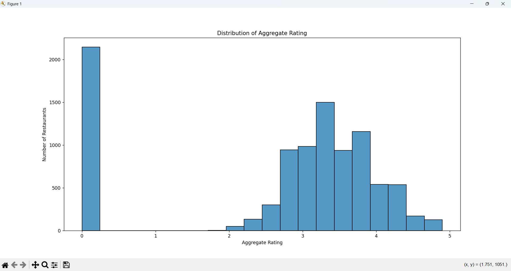

# Level 1 - Task 1: Data Exploration and Preprocessing

## Project Overview

This project was completed as part of the Cognifyz Technologies Data Science Internship.

The objective of this task is to explore the restaurant dataset, perform preprocessing, identify missing values, verify data types, and analyze the distribution of the target variable (Aggregate Rating).

## Dataset

- Dataset: Restaurant Dataset (Provided by Cognifyz Technologies)
- File Format: CSV

## Objectives

The following objectives were completed:

- Loaded the dataset using Pandas.
- Explored the dataset structure.
- Identified the number of rows and columns.
- Displayed the first five records.
- Checked column names.
- Examined dataset information.
- Checked missing values.
- Removed missing values.
- Verified data types.
- Analyzed the distribution of the Aggregate Rating.

## Technologies Used

- Python
- Pandas
- Matplotlib
- Seaborn
- VS Code

## Visualization

### Aggregate Rating Distribution

## Output

The following outputs were generated:

- Dataset overview
- Rows and columns count
- Missing value report
- Data type information
- Aggregate Rating distribution histogram

## Conclusion

The dataset was successfully explored and preprocessed. Missing values were handled, data types were verified, and the Aggregate Rating distribution was analyzed to understand the overall pattern of restaurant ratings.

## Author

**Sadhna Kumari**
