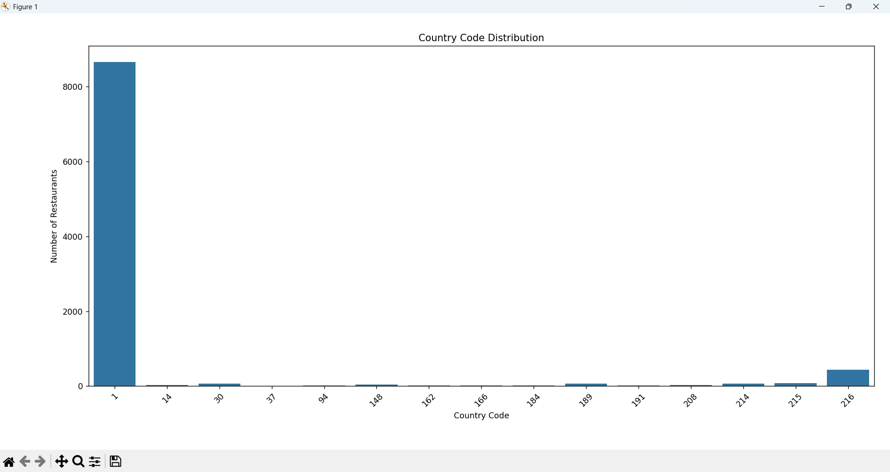
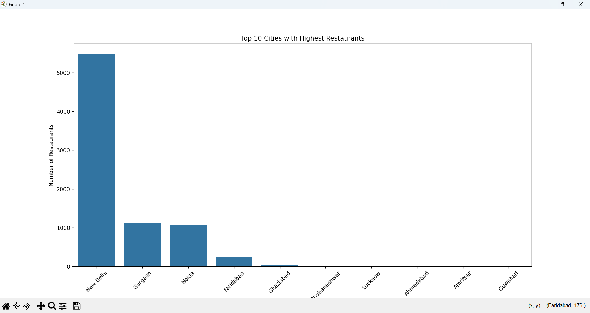
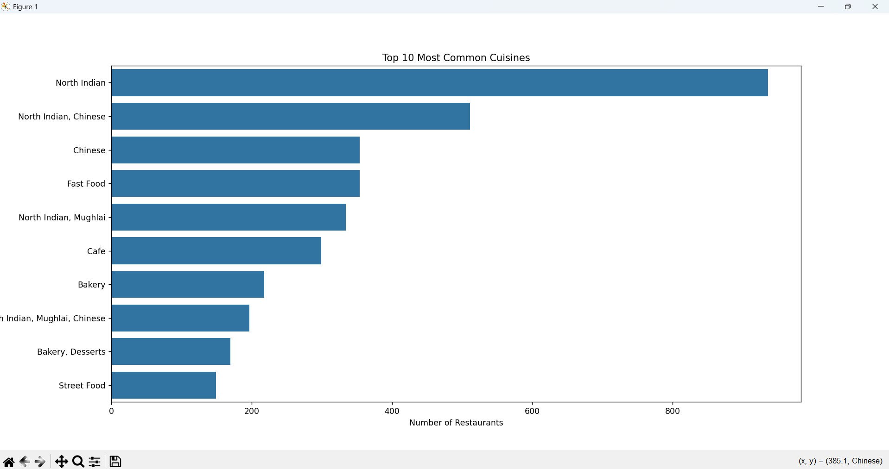

# Descriptive Analysis

## Project Overview

This project is a part of the **Cognifyz Technologies Data Science Internship**.

The objective of this task is to perform descriptive analysis on the restaurant dataset by calculating statistical measures and exploring the distribution of countries, cities, and cuisines.

## Dataset

- **Dataset:** Restaurant Dataset
- **File Format:** CSV
- **Source:** Provided by Cognifyz Technologies

## Objectives

The following tasks were completed:

- Calculated Mean of numerical columns.
- Calculated Median of numerical columns.
- Calculated Standard Deviation.
- Analyzed Country Code distribution.
- Identified Top 10 Cities with the highest number of restaurants.
- Identified Top 10 Most Common Cuisines.
- Created visualizations using Seaborn and Matplotlib.

## Technologies Used

- Python
- Pandas
- Matplotlib
- Seaborn

# Visualizations

## 1. Country Code Distribution

## 2. Top 10 Cities with Highest Restaurants

## 3. Top 10 Most Common Cuisines

## Results

- Calculated statistical measures such as Mean, Median, and Standard Deviation.
- Identified the countries with the highest number of restaurants.
- Found the top cities containing the maximum number of restaurants.
- Identified the most popular cuisines in the dataset.
- Visualized all results using professional charts.

## Conclusion

The descriptive analysis provided valuable insights into the restaurant dataset. The visualizations clearly highlighted the distribution of countries, cities, and cuisines, helping to better understand the overall characteristics of the data.

## Author

**Sadhna Kumari**
